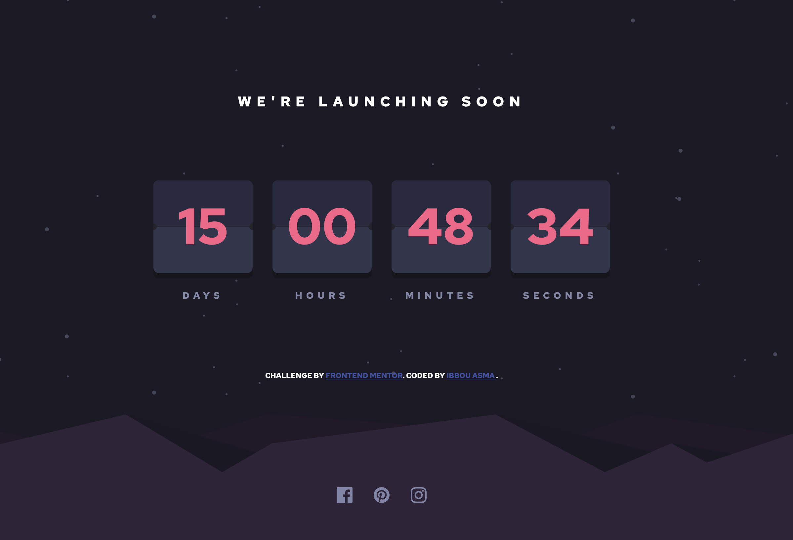

# Frontend Mentor - Launch countdown timer solution

This is a solution to the [Launch countdown timer challenge on Frontend Mentor](https://www.frontendmentor.io/challenges/launch-countdown-timer-N0XkGfyz-). Frontend Mentor challenges help you improve your coding skills by building realistic projects. 

## Table of contents

- [Overview](#overview)
  - [The challenge](#the-challenge)
  - [Screenshot](#screenshot)
  - [Links](#links)
- [My process](#my-process)
  - [Built with](#built-with)
  - [What I learned](#what-i-learned)
  - [Continued development](#continued-development)
  - [Useful resources](#useful-resources)
- [Author](#author)
- [Acknowledgments](#acknowledgments)

**Note: Delete this note and update the table of contents based on what sections you keep.**

## Overview

### The challenge

Users should be able to:

- See hover states for all interactive elements on the page
- See a live countdown timer that ticks down every second (start the count at 14 days)
- **Bonus**: When a number changes, make the card flip from the middle

### Screenshot

  

### Links

- Solution URL: (https://ibboua.github.io/Countdown/)
- Live Site URL: (https://github.com/Ibboua/Countdown)

## My process

### Built with

- Building page in HTML5
- Design in CSS
- Countdown coding & animation in JS

### What I learned

Thanks to this project I learned how to create a great flip animation in JS, and how to use svg which I feared at the beginning.

```html
      <div class="countdown-block">
        <span class="days time-elem">
          <span class="top">00</span>
          <span class="top-back">
            <span>00</span>
          </span>
          <span class="bottom">00</span>
          <span class="bottom-back">
            <span>00</span>
          </span>
        </span>
        <span class="title">Days</span>
      </div>
```

```js
    function init() {
        totalSeconds = Math.floor((new Date('September 17, 2022') - new Date()) / 1000); }
```

### Continued development

For future projects I would like to continue to focus on animations because it is something that is starting to interest me a lot, giving life to web models, and above all I want to be even more comfortable with JS, because it's a language that I really like for the simple fact that it is all-terrain.

### Useful resources

- [Example resource 1](https://www.jqueryscript.net/time-clock/Flip-Clock-Style-jQuery-Countdown-Count-Up-Timer-Plugin-flipTimer.html) - this site helped me understand how I could go about successfully animating the flips, I liked using this model because the code is clean even if the design remains very simplistic.
- [Example resource 2](https://www.youtube.com/watch?v=JvbvnckvIZg&t=1669s) - I used this Youtube video to inspire me from the way the person made his design to try to reproduce the same thing without necessarily copying and pasting his code.

## Author

- Website - [Asma Ibbou](https://github.com/Ibboua)

## Acknowledgments

I am very grateful to the video of "tsbsankara" which put me on the right track for the project, I was inspired by this solution which was not bad.
